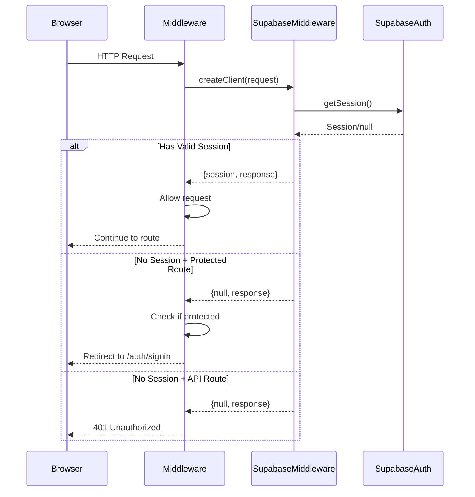
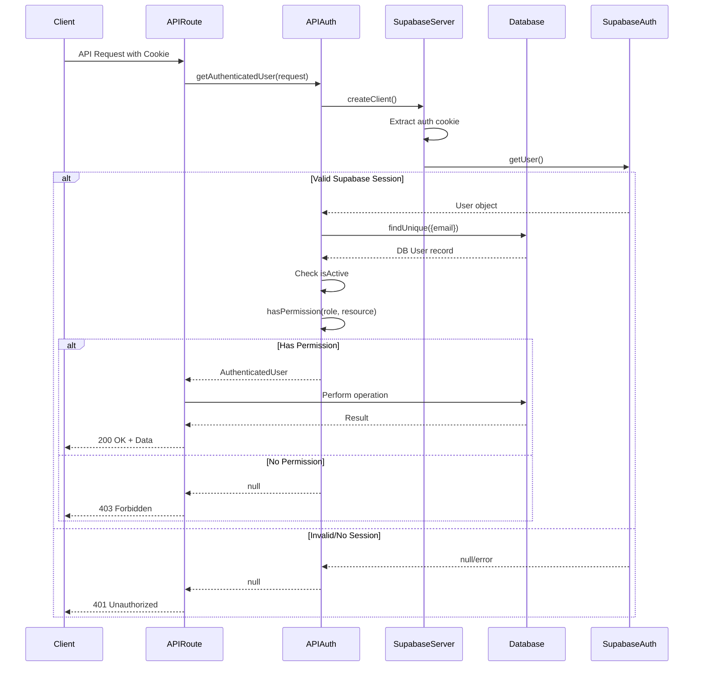
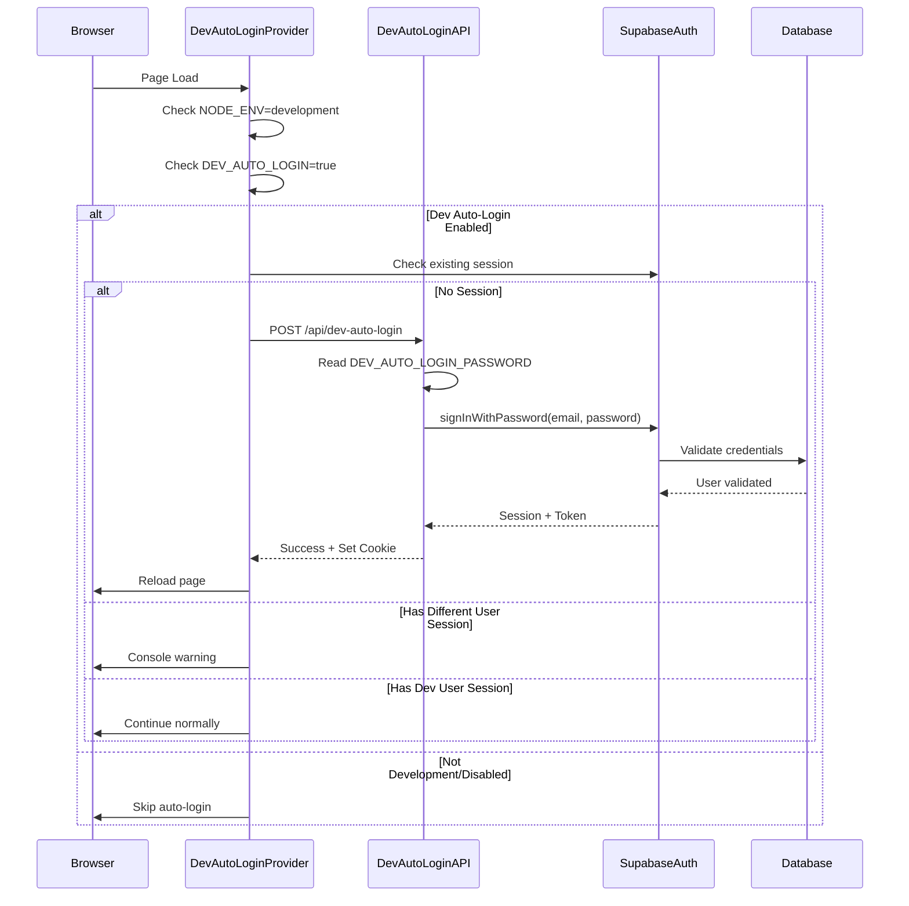
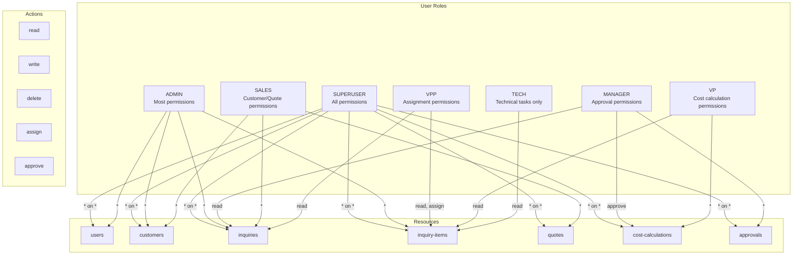
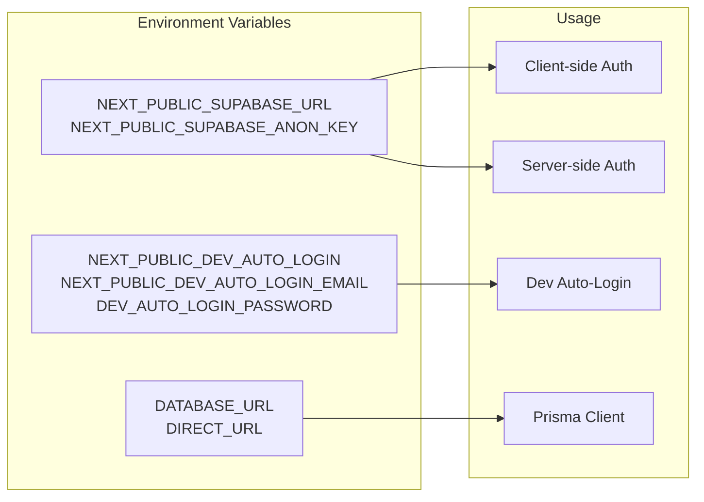

# Authentication Flow Diagram

This document contains detailed Mermaid diagrams showing the authentication flow in the GS-CMS v06 application using Supabase Auth.

## Complete Authentication Flow

```mermaid
flowchart TB
    subgraph "Client Side"
        Browser[Browser/Client]
        DevAutoLogin[DevAutoLoginProvider]
        AuthProvider[AuthProvider]
        UseAuth[useAuth Hook]
        Components[React Components]
    end

    subgraph "Middleware Layer"
        MW[middleware.ts]
        MWSupabase[Supabase Middleware Client]
    end

    subgraph "Server Side"
        API[API Routes]
        ServerSupabase[Supabase Server Client]
        APIAuth[api-auth.ts]
        AuthHelpers[auth-helpers.ts]
        DB[(Database)]
    end

    subgraph "Supabase Cloud"
        SupabaseAuth[Supabase Auth Service]
        SupabaseDB[Supabase Database]
    end

    %% Initial Page Load Flow
    Browser -->|1. Request Page| MW
    MW -->|2. Create Supabase Client| MWSupabase
    MWSupabase -->|3. Check Session| SupabaseAuth
    SupabaseAuth -->|4. Return Session| MWSupabase
    MW -->|5. Protected Route Check| MW
    MW -->|6a. No Session + Protected| Browser
    MW -->|6b. Has Session| API

    %% Dev Auto-Login Flow
    Browser -->|7. Load Page| DevAutoLogin
    DevAutoLogin -->|8. Check Dev Mode| DevAutoLogin
    DevAutoLogin -->|9. POST /api/dev-auto-login| API
    API -->|10. Sign In| SupabaseAuth
    SupabaseAuth -->|11. Return Session| API
    API -->|12. Set Cookie| Browser

    %% Authentication Hook Flow
    Components -->|13. useAuth()| UseAuth
    UseAuth -->|14. Get Session| AuthProvider
    AuthProvider -->|15. Fetch User| ServerSupabase
    ServerSupabase -->|16. Get Auth User| SupabaseAuth
    ServerSupabase -->|17. Get DB User| DB
    DB -->|18. User Data| UseAuth

    %% API Authentication Flow
    Components -->|19. API Call| API
    API -->|20. getAuthenticatedUser()| APIAuth
    APIAuth -->|21. Get Session| ServerSupabase
    ServerSupabase -->|22. Verify Session| SupabaseAuth
    APIAuth -->|23. Get User from DB| DB
    APIAuth -->|24. Check Permissions| APIAuth
    API -->|25. Return Data/Error| Components

    %% Sign In Flow
    Browser -->|26. Sign In Form| API
    API -->|27. signInWithPassword| SupabaseAuth
    SupabaseAuth -->|28. Validate Credentials| SupabaseDB
    SupabaseAuth -->|29. Create Session| SupabaseAuth
    SupabaseAuth -->|30. Return Token| API
    API -->|31. Set Auth Cookie| Browser

    %% Sign Out Flow
    Components -->|32. Sign Out| UseAuth
    UseAuth -->|33. signOut()| ServerSupabase
    ServerSupabase -->|34. Invalidate Session| SupabaseAuth
    SupabaseAuth -->|35. Clear Session| Browser
```

## Middleware Authentication Check



## API Route Authentication



## Dev Auto-Login Flow



## Client-Side Auth Hook Flow

```mermaid
flowchart LR
    subgraph "Component"
        Comp[React Component]
        Hook[useAuth Hook]
    end

    subgraph "Auth Context"
        AuthCtx[AuthProvider Context]
        Session[Session State]
        User[User State]
    end

    subgraph "Supabase Client"
        Client[Supabase Browser Client]
        Listener[Auth State Listener]
    end

    Comp -->|1. useAuth()| Hook
    Hook -->|2. useContext| AuthCtx
    AuthCtx -->|3. Get session| Client
    Client -->|4. onAuthStateChange| Listener
    Listener -->|5. Session updates| Session
    Session -->|6. Trigger re-render| User
    User -->|7. Updated user data| Comp

    Listener -->|SIGNED_IN| Session
    Listener -->|SIGNED_OUT| Session
    Listener -->|TOKEN_REFRESHED| Session
```

## Permission System



## Cookie and Token Management

```mermaid
flowchart TB
    subgraph "Cookie Structure"
        Cookie[sb-{project-ref}-auth-token]
        CookieData["{<br/>access_token: JWT,<br/>refresh_token: string,<br/>user: {...}<br/>}"]
    end

    subgraph "Token Flow"
        Access[Access Token<br/>Short-lived ~1hr]
        Refresh[Refresh Token<br/>Long-lived]
        NewAccess[New Access Token]
    end

    subgraph "Refresh Process"
        Check{Token Expired?}
        RefreshAPI[Call Refresh API]
        UpdateCookie[Update Cookie]
    end

    Cookie --> CookieData
    CookieData --> Access
    CookieData --> Refresh
    
    Access --> Check
    Check -->|Yes| RefreshAPI
    RefreshAPI --> Refresh
    Refresh --> NewAccess
    NewAccess --> UpdateCookie
    UpdateCookie --> Cookie
    
    Check -->|No| Continue[Continue Request]
```

## Environment Configuration



## Key Files and Their Roles

1. **`/src/middleware.ts`** - Protects routes, checks sessions
2. **`/src/utils/supabase/server.ts`** - Server-side Supabase client
3. **`/src/utils/supabase/client.ts`** - Browser Supabase client
4. **`/src/utils/supabase/middleware.ts`** - Middleware Supabase client
5. **`/src/utils/supabase/api-auth.ts`** - API route authentication
6. **`/src/lib/auth-helpers.ts`** - Server component auth helpers
7. **`/src/hooks/use-auth.ts`** - Client-side auth hook
8. **`/src/components/auth/dev-auto-login-provider.tsx`** - Dev auto-login
9. **`/src/app/api/dev-auto-login/route.ts`** - Dev auto-login API

## Security Considerations

- Dev auto-login only works in development environment
- All API routes check authentication via middleware
- Permissions are checked at the API level using role-based access
- Cookies are httpOnly and secure in production
- Database user must be active for authentication to succeed
- Tokens are automatically refreshed by Supabase client