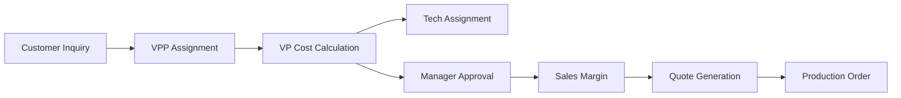

# Context7 Configuration for GS-CMS Enterprise

## Overview
Context7 is configured to maintain deep understanding of the GS-CMS project's business domain, technical architecture, and workflow patterns. This file defines how Context7 should track and relate different aspects of the system.

## Core Context Domains

### 1. Business Workflow Context
Track the complete lifecycle of inquiries through the system:



**Context Tracking Points:**
- Current state of each inquiry item
- Assignment history and workload distribution
- Approval chains and decision points
- Cost calculation versions
- Quote validity and expiration

### 2. Entity Relationship Context

**Primary Entities:**
```typescript
// Context7 should understand these relationships
User -> UserGroup (many-to-many via membership)
User -> InquiryItem (various assignment relationships)
Customer -> Inquiry (one-to-many)
Inquiry -> InquiryItem (one-to-many)
InquiryItem -> Calculation (one-to-many versions)
InquiryItem -> ItemFile (one-to-many)
Inquiry -> Quote (one-to-many)
Quote -> QuoteItem (one-to-many)
```

**Key Relationships to Track:**
- User role determines available actions
- Item assignment creates workflow obligations
- Cost approval gates quote generation
- File attachments provide calculation context

### 3. Permission Matrix Context

```yaml
permissions:
  superuser:
    - all: "*"
  
  admin:
    - users: [create, read, update, delete]
    - system: [configure, backup]
    - reports: [view_all, export]
  
  manager:
    - approvals: [costs, quotes]
    - reports: [view_all, export]
    - inquiries: [read, update]
  
  sales:
    - inquiries: [create, read, update]
    - quotes: [create, read, update, send]
    - customers: [create, read, update]
    - pricing: [apply_margins, view_costs]
  
  vpp:
    - assignments: [assign_to_vp, reassign]
    - inquiries: [read, update]
    - reports: [view_production]
  
  vp:
    - assignments: [assign_to_tech]
    - calculations: [create, update]
    - inquiries: [read, update]
  
  tech:
    - inquiries: [read_assigned, update_assigned]
    - documents: [upload, view]
```

### 4. UI Component Context

**Component Hierarchy:**
```
App
├── (auth)
│   └── LoginPage
├── (dashboard)
│   ├── Layout
│   │   ├── Sidebar (role-based menu)
│   │   └── Header (user info, notifications)
│   ├── Dashboard (role-specific views)
│   ├── Customers
│   │   ├── CustomerList
│   │   ├── CustomerForm
│   │   └── CustomerDetail
│   ├── Inquiries
│   │   ├── InquiryList
│   │   ├── InquiryForm
│   │   └── InquiryItemDetail
│   ├── Assignments
│   │   ├── UnassignedTable
│   │   ├── AssignmentFlow
│   │   └── WorkloadStats
│   └── Quotes
│       ├── QuoteBuilder
│       ├── QuotePDF
│       └── QuoteHistory
```

**Component Patterns:**
- Tables use TanStack Table with pagination
- Forms use react-hook-form with Zod validation
- Modals use shadcn/ui Dialog components
- Loading states use Skeleton components
- Error boundaries wrap feature sections

### 5. API Endpoint Context

**RESTful Structure:**
```
/api/auth/[...nextauth] - Authentication
/api/customers/* - Customer management
/api/inquiries/* - Inquiry CRUD
/api/inquiry-items/* - Item-specific operations
/api/assignments/* - Assignment workflows
/api/calculations/* - Cost calculations
/api/quotes/* - Quote generation
/api/reports/* - Analytics and reporting
/api/files/* - File upload/download
```

**Common Patterns:**
- GET endpoints support pagination, filtering, sorting
- POST/PUT endpoints validate with Zod schemas
- All endpoints check authentication and permissions
- Errors return consistent JSON structure
- Success responses include metadata

### 6. State Management Context

**Client State Patterns:**
```typescript
// React Query for server state
const { data, isLoading, error } = useQuery({
  queryKey: ['inquiries', filters],
  queryFn: () => fetchInquiries(filters)
})

// Local state for UI
const [selectedItems, setSelectedItems] = useState<string[]>([])
const [isAssigning, setIsAssigning] = useState(false)

// Form state with react-hook-form
const form = useForm<InquiryFormData>({
  resolver: zodResolver(inquirySchema),
  defaultValues: {...}
})
```

**State Update Patterns:**
- Optimistic updates for better UX
- Invalidate queries after mutations
- Debounce search inputs
- Persist filters in URL params

### 7. Business Rules Context

**Critical Business Rules:**
1. **Assignment Rules:**
   - Only VPP can assign items to VP
   - Only VP can assign to Tech
   - Cannot assign to inactive users
   - Workload balancing is suggested, not enforced

2. **Cost Calculation Rules:**
   - All cost fields must be filled
   - Unit cost auto-calculated from total
   - Previous calculations are versioned
   - Only latest calculation is active

3. **Approval Rules:**
   - Manager approval required for costs
   - Approval locks cost values
   - Rejected items require recalculation
   - Approval history is maintained

4. **Quote Rules:**
   - Only approved items can be quoted
   - Margins applied by sales role only
   - Quotes have expiration dates
   - Accepted quotes become orders

### 8. Performance Context

**Optimization Points:**
- Index on frequently queried fields
- Pagination on all list views
- Lazy load file attachments
- Cache user permissions
- Batch API calls where possible
- Use React Server Components

**Query Patterns:**
```typescript
// Efficient query with relations
const items = await prisma.inquiryItem.findMany({
  where: { assignedToVpId: userId },
  include: {
    inquiry: {
      include: { customer: true }
    },
    calculations: {
      orderBy: { version: 'desc' },
      take: 1
    }
  },
  orderBy: { requestedDelivery: 'asc' },
  take: 20,
  skip: (page - 1) * 20
})
```

### 9. Security Context

**Security Layers:**
1. **Authentication:** NextAuth with JWT
2. **Authorization:** Role-based checks
3. **Data Validation:** Zod schemas
4. **SQL Injection:** Prisma parameterized queries
5. **XSS Protection:** React escaping
6. **CSRF:** NextAuth CSRF tokens
7. **Rate Limiting:** API middleware

**Sensitive Operations:**
- User password changes
- Cost approval decisions
- Quote margin application
- User role assignments

### 10. Testing Context

**Test Coverage Areas:**
```typescript
// Unit Tests
- Business logic functions
- Utility functions
- Validation schemas
- Permission checks

// Integration Tests
- API endpoints
- Database operations
- Authentication flows
- File uploads

// E2E Tests
- Complete inquiry workflow
- Assignment and approval flow
- Quote generation process
- User management
```

## Context7 Usage Patterns

### Pattern 1: Workflow State Tracking
```typescript
// Context7 tracks inquiry item state transitions
interface ItemWorkflowState {
  currentState: 'unassigned' | 'assigned_vp' | 'costed' | 'approved' | 'quoted'
  allowedTransitions: string[]
  blockingFactors: string[]
  nextResponsibleRole: string
}
```

### Pattern 2: Permission Checking
```typescript
// Context7 understands permission requirements
function canUserPerformAction(
  user: User,
  action: string,
  resource: any
): boolean {
  // Context7 knows which roles can do what
}
```

### Pattern 3: Related Data Loading
```typescript
// Context7 suggests required includes
const inquiryWithContext = await loadInquiryWithContext(id)
// Automatically includes customer, items, calculations, files
```

### Pattern 4: Business Rule Validation
```typescript
// Context7 enforces business rules
const validation = validateBusinessRules(action, data)
// Checks all applicable rules for the context
```

## Maintenance Guidelines

### Adding New Features
1. Update entity relationships in Context7
2. Define new permissions if needed
3. Add workflow states if applicable
4. Document business rules
5. Update component hierarchy
6. Add API endpoint patterns

### Monitoring Context Health
- Regular review of relationship accuracy
- Validate permission matrix quarterly
- Update workflow diagrams
- Verify business rule enforcement
- Check performance patterns

## Context7 Prompts

Use these prompts to query Context7:

1. "What permissions does a VP need to calculate costs?"
2. "Show the complete workflow for an inquiry item"
3. "What data is needed to display the VP dashboard?"
4. "Which API endpoints can a sales user access?"
5. "What are the business rules for quote generation?"
6. "Show all entities related to InquiryItem"
7. "What validations apply to cost calculations?"
8. "Which components need role-based rendering?"

## Integration Checklist

- [ ] Context7 understands all entity relationships
- [ ] Workflow states are properly mapped
- [ ] Permission matrix is complete
- [ ] Business rules are documented
- [ ] Component hierarchy is current
- [ ] API patterns are defined
- [ ] Performance optimizations noted
- [ ] Security contexts established
- [ ] Test coverage areas marked

This configuration ensures Context7 provides intelligent assistance throughout development, maintaining consistency and catching potential issues early.